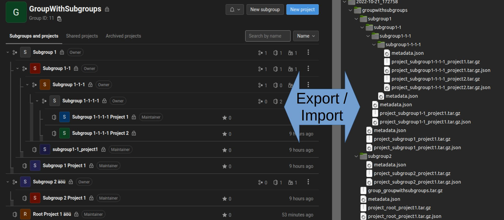
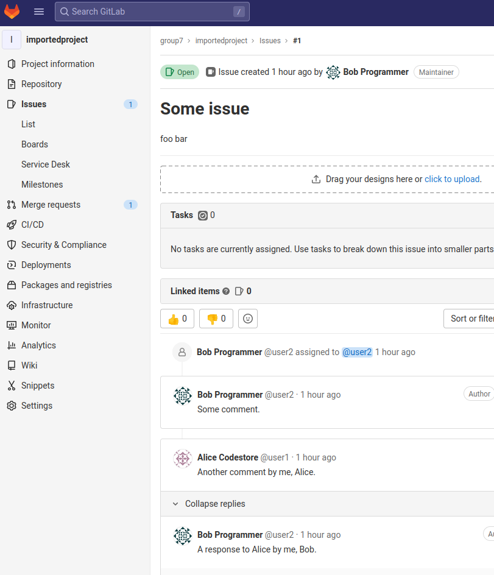

# Gitlab Export Import

Python program to recursively export and import Gitlab groups, subgroups and their projects.
Basically, to automatize Gitlab-to-Gitlab migration.

## Requirements

* Python 3.8+
    * pipenv, install with `python3 -m pip install --user -U pipenv`

## How-To Run

1. Create your Gitlab API private access token (https://GITLAB/-/profile/personal_access_tokens)
2. `pipenv sync`
3. `pipenv run python gitlab_export_import.py`

## Other Tools & Links

- Gitlab
    - Group export: https://python-gitlab.readthedocs.io/en/stable/cli-objects.html#gitlab-group-export 
    - Projekte export: https://python-gitlab.readthedocs.io/en/stable/cli-objects.html#gitlab-project-export
    - Automate Group & Project export: https://docs.gitlab.com/ee/user/project/import/#automate-group-and-project-import
    - Congrgate: https://gitlab.com/gitlab-org/professional-services-automation/tools/migration/congregate, "Congregate is an automation wrapper around the GitLab APIs, in particular the export/import and user APIs."
- https://github.com/rverchere/gitlab-migrator.git similar, uses python-gitlab for recursive export and import of groups & projects.

## Issues With Broken User Account Associations

Problem:
- After importing the original account associations are broken.
- All user-linked activities (issues, merge requests, etc.) will get associated to the importing user.
- All user comments will get associated to the importing user with an additional system-comment such as "By ORIGINAL_USER on DATE_TIME (imported from GitLab)".

c.f. "GitLab Project Import: Preserving user contribution associations with existing group members" [https://gitlab.com/gitlab-org/gitlab/-/issues/223137]:

> As described in #19128 (closed), an admin account is required to import projects with contributions associated to users.

Gitlab documentation [https://docs.gitlab.com/ee/user/project/settings/import_export.html#map-users-for-import]:

> "Imported users can be mapped by their public email addresses on self-managed instances, if an administrator (not an owner) does the import." 

### Import as Normal User

When imported by a normal, non-admin user:

### Import as Admin User

Same effect with broken associations even when importing is done as admin-user *and* not following the required steps:

All steps from official Gitlab documentation have been followed [https://docs.gitlab.com/ee/user/project/settings/import_export.html#map-users-for-import]:

> Imported users can be mapped by their public email addresses on self-managed instances, if an administrator (not an owner) does the import.

Done. CHECK

> The project must be exported by a project or group member with the Owner role.

Done. CHECK

> Public email addresses are not set by default. Users must set it in their profiles for mapping to work correctly.

Done. CHECK

> For contributions to be mapped correctly, users must be an existing member of the namespace, or they can be added as a member of the project. Otherwise, a supplementary comment is left to mention that the original author and the merge requests, notes, or issues that are owned by the importer.

Done. CHECK

As you can see, then the import works and the user contributions mappings are being mapped:

