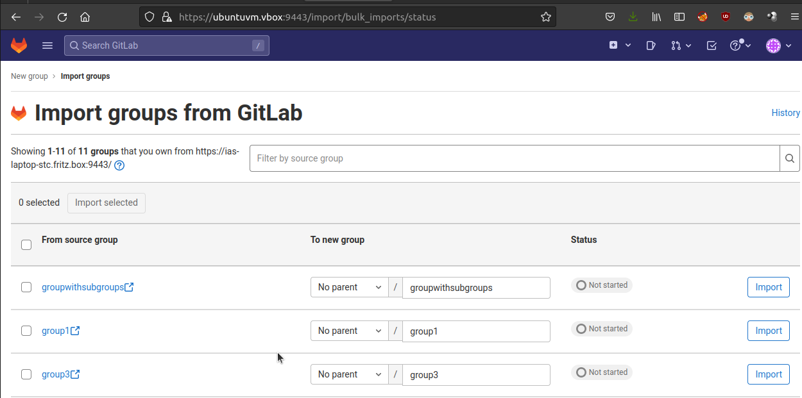

# Docker-Gitlab

Gitlab as Docker, for local experiments, e.g., Gitlab-to-Gitlab migration experiments and script development for export/import automatization via Gitlab API.

## How-To Start

1. `docker-compose up`
    - `docker-compose exec gitlab gitlab-ctl status`
2. https://localhost:9443/
3. Login with username "root" and password "adminadmin" (see `docker-compose.yml`, variable `GITLAB_ROOT_PASSWORD`)

## SSL

Create HTTPS/SSL certificate `/etc/gitlab/ssl/$HOSTNAME.crt`:

`docker-compose exec gitlab sh -c "mkdir -p /etc/gitlab/ssl && chmod 755 /etc/gitlab/ssl &&  openssl req -x509 -nodes -days 365 -newkey rsa:2048 -keyout /etc/gitlab/ssl/\$HOSTNAME.key -out /etc/gitlab/ssl/\$HOSTNAME.crt"`

## Gitlab-to-Gitlab Migration / Import

Note: For local tests, you need to explicitly allow local area networking access:

